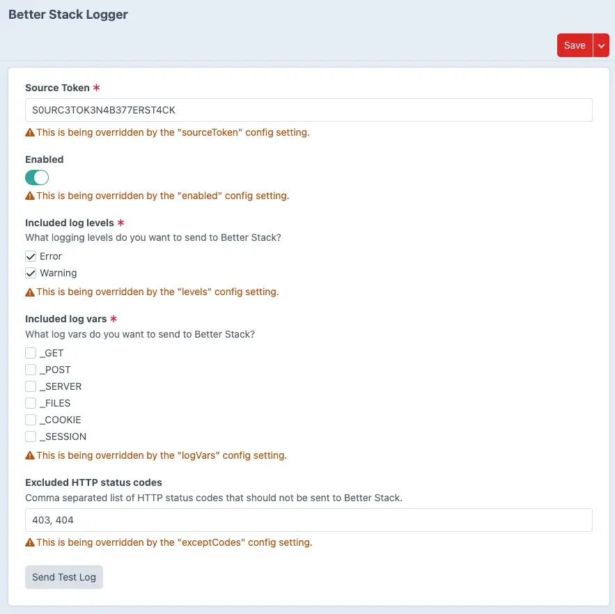

# Better Stack Logger for CraftCMS

Pushes Craft CMS logs to [Better Stack](https://betterstack.com/telemetry) through a real Yii 2 log target.



## Features

- Native Yii 2 log target that is fully customisable
- All errors and warnings for each request are sent
- Plugin settings can be defined in the CP or with a config file
- Calls for `Craft::error()` and `Craft::warning()` are sent and categorized

## Requirements

This plugin requires Craft CMS 5.5.0 or later, and PHP 8.2 or later.

## Installation

You can install this plugin from the Plugin Store or with Composer.

### From the Plugin Store

Go to the Plugin Store in your project’s Control Panel and search for “Better Stack Logger”. Then press “Install”.

### With Composer

Open your terminal and run the following commands:

```bash
# go to the project directory
cd /path/to/my-project.test

# tell Composer to load the plugin
composer require arcane-web-design/craft-better-stack-logger

# tell Craft to install the plugin
./craft plugin/install better-stack-logger
```

## Basic configuration

You can configure the plugin settings directly in the CP or you can create a `config/better-stack-logger.php` config file
with the following contents. Make sure to update your `.env` environment file accordingly with the correct values.

```php
<?php

use craft\helpers\App;

return [

    '*' => [
        'enabled' => false,
        'sourceToken' => App::env('BETTERSTACK_SOURCE_TOKEN'),
        'levels' => ['error', 'warning'],
        'logVars' => [],
        'exceptCodes' => [403, 404],
    ],

    'staging' => [
        'enabled' => true,
    ],

    'production' => [
        'enabled' => true,
    ],

];
```

## Configuration parameters

This plugin adds a native Yii 2 log target that is an instance of the [yii\log\Target](https://www.yiiframework.com/doc/api/2.0/yii-log-target)
class. See the [Yii 2 API Documentation](https://www.yiiframework.com/doc/api/2.0/yii-log-target) for all available
properties.

### `enabled`

This parameter is a boolean that indicates whether this log target is enabled.

### `sourceToken`

This required parameter is a string given to you by Better Stack when configuring a new log source.

### `levels`

This required parameter is an array of log level names that this log target is interested in. Defaults to `error` and
`warning`. We have intentionally disabled reporting `info`, `profile` and `debug` log levels to Better Stack because Craft
generates a lot of messages for these log levels.

### `logVars`

This optional parameter is an array of global arrays that will be sent to Better Stack. Defaults to `[]`. We have intentionally disabled sending logVars to Better Stack because Craft
generates a lot of messages for these. In production, you may want these to help investigate bugs.

### `exceptCodes`

This optional parameter is an array of HTTP status codes that this log target is NOT interested in. This is a shortcut
for the `except` parameter to make it easier. Defaults to `403` and `404`, meaning that `yii\web\HttpException:403` and
`yii\web\HttpException:404` categories will be excluded from the `categories` parameter.
